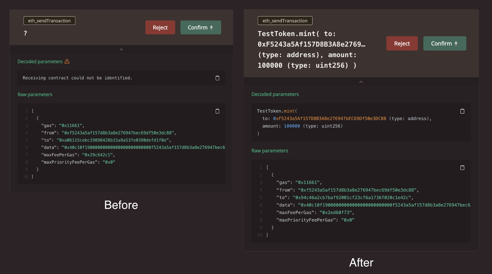
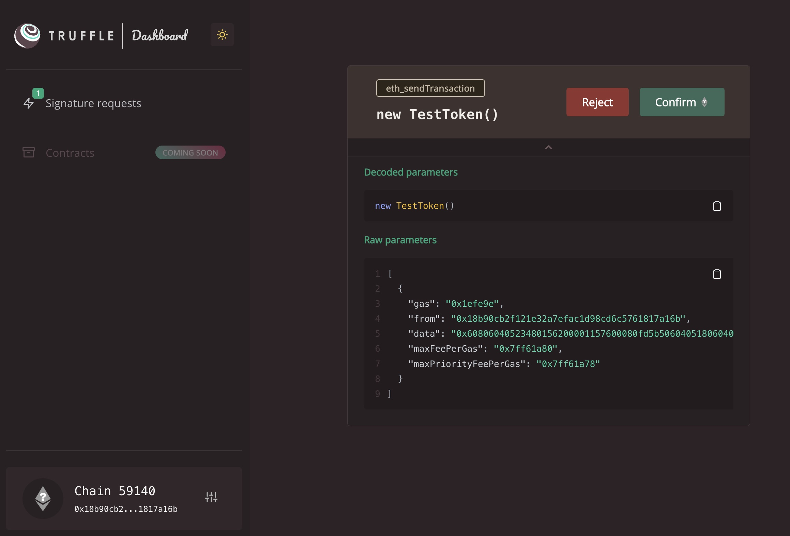

# @truffle/dashboard-hardhat-plugin

Enable decoded results when using [Truffle Dashboard](https://trufflesuite.com/docs/truffle/how-to/use-the-truffle-dashboard/) with your Hardhat projects.

## What

This plugin enables you to see decoded transaction information (both the function signature and the values of any arguments passed) when using [Truffle Dashboard](https://trufflesuite.com/docs/truffle/how-to/use-the-truffle-dashboard/) with your Hardhat projects.

It extends `npx hardhat compile` by sending the compiled artifacts to Truffle Dashboard, which in turn uses [@truffle/decoder](https://trufflesuite.com/docs/truffle/codec/modules/_truffle_decoder.html) for decoding, giving you that extra degree of visibility before signing the transactions with your browser-based wallet.



## Installation

You can install this plugin with `npm` (or `yarn`) by running:

```bash
npm i @truffle/dashboard-hardhat-plugin -D
```

Beyond that, simply import the plugin in your `hardhat.config.js`:

```ts
import "@truffle/dashboard-hardhat-plugin";
```

## Setup

This extension assumes you have `truffle` installed (either globally or in a local project context). If not, you can install it with `npm i -g truffle`. Beyond this you'll be able to start Truffle Dashboard with `truffle dashboard`. For reference, more information on using the Truffle Dashboard can be found [here](https://trufflesuite.com/docs/truffle/how-to/use-the-truffle-dashboard/).

Alternatively, you can skip the installation and fetch (and run) it remotely with `npx truffle dashboard`.

### Configuration

To make sure the plugin knows where to send the compiled artifacts (and subsequent transactions), you'll need to add a `dashboard` network (or whatever name you like) to your `hardhat.config.js`:

```ts
const config: HardhatUserConfig = {
  networks: {
    dashboard: {
      url: "http://localhost:24012/rpc"
    }
  },
  ...
}
```

## Usage

Assuming the above is all looking good, any subsequent compilations via `npx hardhat compile` will send the compiled artifacts to Truffle Dashboard. Subsequently, any deployments (or transactions via scripts) that target the `dashboard` network will now send them to Truffle Dashboard for signing via your browser-based wallet.

> Note you'll need to ensure your browser-based wallet is unlocked for transactions to be received (otherwise you might see a `Cannot read properties of null (reading 'sendTransaction')` when running the command below).

```bash
npx hardhat run scripts/deploy.ts --network dashboard
```



## Support

As always, if you have any questions or run into any issues, please reach out to us on our [Github Discussion board](https://github.com/orgs/trufflesuite/discussions) or on [Twitter](https://twitter.com/trufflesuite).
